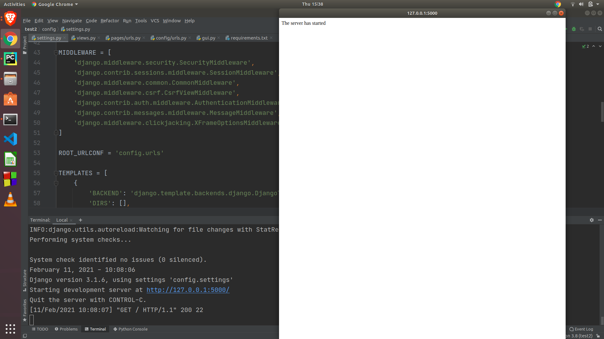

# Django-Desktop-app
The following is the sample Desktop app that when opened starts the Django Server. 
#### Overview
The following app is a sample app with the Django framework as backend / frontend display it uses the flaskwebgui library to run the django web app as a native desktop app.
* **Backend** - The desktop app is powered by the Django backend server 
* **Frontend** - The desktop app has Django frontend which displays "The server has started once the server starts", the django can be used to modify the UI if required.
* **Desktop App** - The above two used are used to develop basic Django app which then later is rendered as native desktop app using **flaskwebgui** library whose UI can be modified accordingly if required.

#### Usage Instruction 
* Clone the given github repository using <br>
  ```git colne git@github.com:architsharmaa/Django-Desktop-app.git``` (for SSH keys)<br><br>
  ```git colne https://github.com/architsharmaa/Django-Desktop-app.git``` (for https)<br><br>
* Install the required dependencies using <br>
``` pip install requirements.txt```<br><br>
* Run the given **Desktop App* by running gui.py or enter following command<br>
```python gui.py```<br><br>

#### Demo 

The final desktop app running with django server<br><br>

